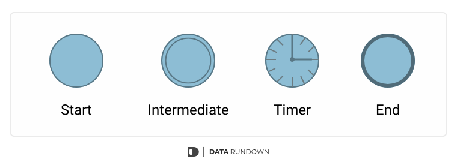
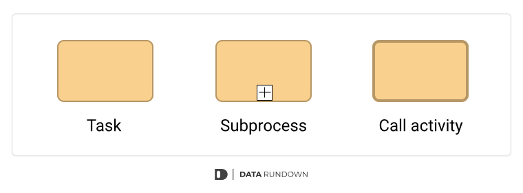
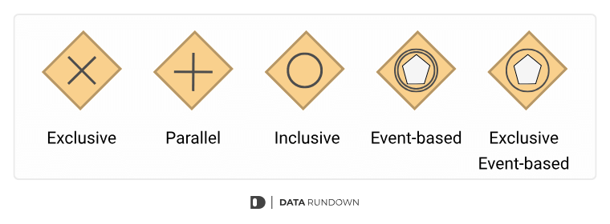
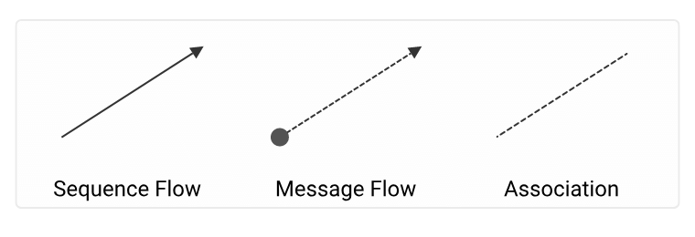
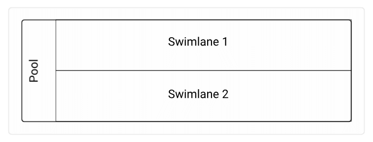

# Intro

we will start by defining the problem of generating this type of diagrams.

## what we have to extract?

to understand the process we have to extract this components:

### Flow Objects

In BPMN, flow objects are the basic building blocks of a process. Flow objects are important because they help to define the order of operations and to identify what needs to happen at each stage of the process

#### Events

- Start: Used to signal the beginning of a process, this is where the process starts. They can be triggered manually or automatically.

- Intermediate: Intermediate events are used to indicate that something has happened during the process. It is used to insert a task into a process.

- Timer: Symbols that mark the start of a timer, for example, to wait some time or for a certain day of the week

- End: Used to end a process and indicating that the process has finished

#### Activities

- Task: The most basic type of activity in BPMN and is used to represent work that needs to be done. It can be anything from simple manual tasks to complex automated processes. Tasks are often very specific.

- Subprocess: A type of task that contains its own internal logic and activity. Sub-processes are often used to model complex workflows and group tasks together.

- Call Activity: A common process used in other areas of the workflow. It allows you to create a reusable process definition that can be reused in multiple other process definitions

#### Gateways

> Gateways within a BPMN diagram are diamond-shaped symbols that map decision points. They determine the direction a process shall take next.

- Exclusive gateway: Exclusive gateway (or XOR Gateway) is used to model decisions where only one path can be taken. For example, an exclusive gateway could be used to decide if a process should continue if a condition is met.
- Parallel gateway: Is used to drive the process into multiple parallel paths and is used to visualize the concurrent execution of activities
  Inclusive gateway: Used to model decisions where more than one path can be taken. They could all be taken, or only one of them.
- Event-based gateway: Event-based Gateways are used to control the process based on events
  Exclusive event-based gateway: Alternative paths are determined by events (for example various messages or signals) rather than by conditional flows

### Connecting Objects

> Connecting objects is one of the key features of BPMN, as it allows you to model the flow of information and data between different parts of a business process.

`There are three different types of connecting objects`

#### Sequence Flows

- Shows the order of activities to be performed. It is shown as a straight line with an arrow.

#### Message Flows

- Defines how a message is passed between two or more BPMN objects.
- The message flow can be used to trigger a process or to send a message between two or more objects.
- The message flow path is a dashed line that connects the message flow objects..

#### Associations

- Illustrated with a dotted line and is used to associate an artifact or text to an event, activity or gateway.
  > For example, if we want to write a comment or additional information to an activity, we can connect that textbox with the association line.

### Pools and Swimlanes

> Pools and swimlanes are a common layout for process-based diagrams.

#### Pools

In a pool, all the lanes are contained within one big rectangle, and the swimlanes are used to divide up the space inside the pool.

#### Swimlanes

Help to identify and track the roles and responsibilities of individuals within a process, as well as how tasks are related to one another. Swimlanes also make it easier to see potential bottlenecks and issues within a process.

When you map out a process using pools and swimlanes, you can identify areas where there is unnecessary waste or duplication of effort.

`When using pools and swimlanes, it’s important to keep a few things in mind.`

- Make sure that all the lanes are clearly labeled and that it’s easy to see which lane each process belongs in
- Try to keep the number of lanes to a minimum – too many lanes can make the diagram more confusing than helpful
- Make sure the swimlanes are wide enough to accommodate all the processes in each lane

### Artifacts

Artifacts can be used to include additional information about a process. Artifacts allow you to visually represent objects outside of the actual process. They can be used to manage tasks or processes, or they can be used to represent data or notes that explain the process.
