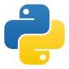

# Tools

in this section we will explore the technologies used to build the docs site and tool it self.

## Docs Website

this site built with the power of **[docusaurus](https://docusaurus.io/)** an open source built by <code>facebook</code> used make documentation sites with markdown files.


this tool uses **[react](https://react.dev/)** under the hood to give a great user and developer experiance, and like <code>docusaurus</code> react is an open source built by <code>facebook</code>.


this site is built tested and deployed on ubuntu server using github pages.


we used the best IDE vs code thanks microsoft for it.


## Donut

this tool is an ai tool built with python.



we built it using the open source library **[crewai](https://www.crewai.com/)** which gives us an efficient way to create agents and make them colaborate together to solve a specific task or a set of tasks.


<!--
## Donut Design

Donut is a distributed agent based llm **built with **[ollama](https://ollama.com/)** models and **[crewai lib](https://github.com/joaomdmoura/CrewAI)**.** -->

<!--
### What you'll need

- [Node.js](https://nodejs.org/en/download/) version 18.0 or above:
  - When installing Node.js, you are recommended to check all checkboxes related to dependencies. -->
<!--
## Generate a new site

Generate a new Docusaurus site using the **classic template**.

The classic template will automatically be added to your project after you run the command:

```bash
npm init docusaurus@latest my-website classic
```

You can type this command into Command Prompt, Powershell, Terminal, or any other integrated terminal of your code editor.

The command also installs all necessary dependencies you need to run Docusaurus. -->

<!--
## Start your site

Run the development server:

```bash
cd my-website
npm run start
```

The `cd` command changes the directory you're working with. In order to work with your newly created Docusaurus site, you'll need to navigate the terminal there.

The `npm run start` command builds your website locally and serves it through a development server, ready for you to view at http://localhost:3000/.

Open `docs/intro.md` (this page) and edit some lines: the site **reloads automatically** and displays your changes. -->
